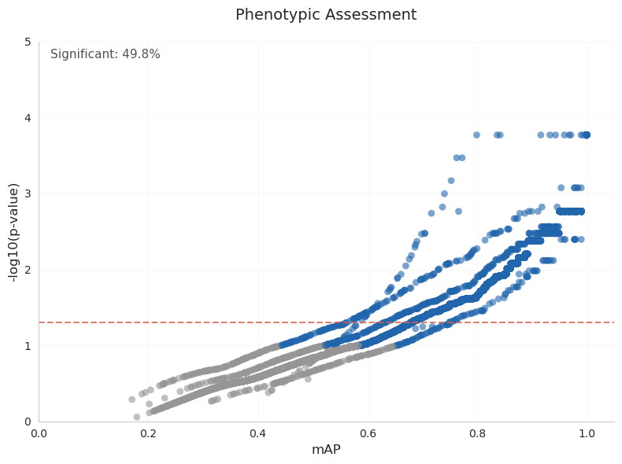
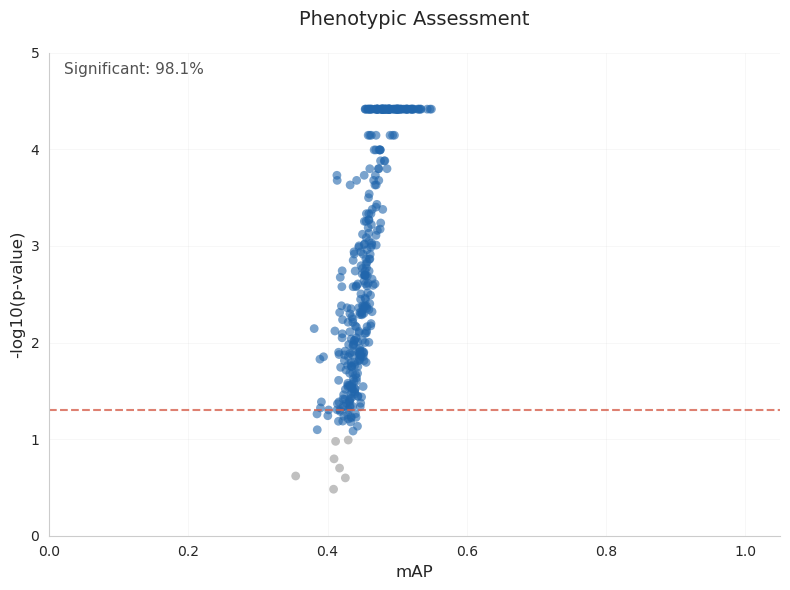
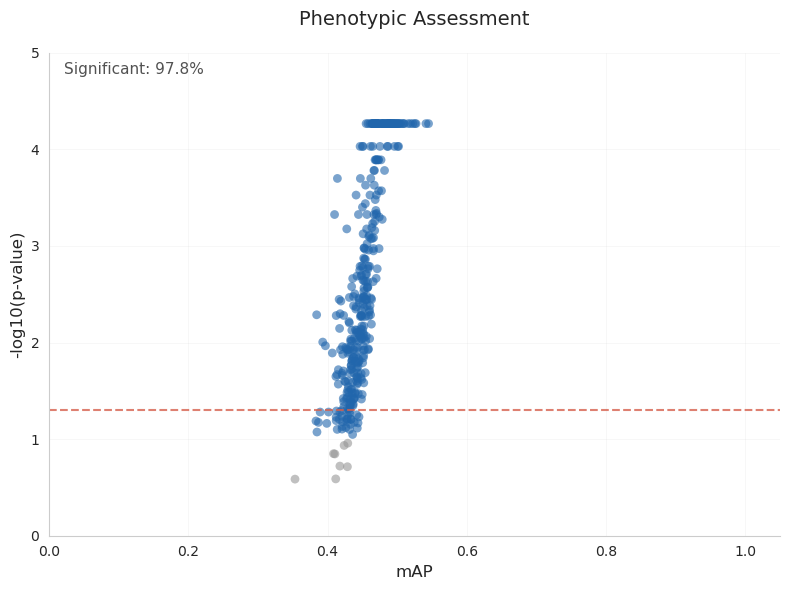

# harmonyrsc

Quick POC for testing [Harmony batch correction](https://rapids-singlecell.readthedocs.io/en/latest/api/generated/rapids_singlecell.pp.harmony_integrate.html#rapids_singlecell.pp.harmony_integrate) from [rapids-singlecell](https://scanpy.readthedocs.io/en/stable/index.html) on morphological profiling data from the [JUMP](https://broad.io/jump) dataset.

## Installation

```bash
pixi install
```

## Test with JUMP data

Download test data:

```bash
mkdir -p data/raw/profiles
wget \
    https://cellpainting-gallery.s3.amazonaws.com/cpg0016-jump-assembled/source_all/workspace/profiles_assembled/ORF/v1.0b/profiles_wellpos_var_mad_int_featselect.parquet \
    -O data/raw/profiles/jump_orf.parquet
```

Run Harmony:

```bash
mkdir -p data/intermediate/profiles
pixi run python harmonyrsc.py \
    data/raw/profiles/jump_orf.parquet \
    data/intermediate/profiles/jump_orf_harmonized.parquet \
    Metadata_Plate
```

Evaluate results using [copairs](https://github.com/cytomining/copairs):

```bash
mkdir -p data/external
wget \
    https://github.com/jump-cellpainting/datasets/releases/download/v0.12/jump_metadata.duckdb \
    -O data/external/jump_metadata.duckdb
```

```bash
RUN_COPAIRS='pixi run copairs-runner --config-dir configs/ --config-name copairs'
RUN_COPAIRS_BASE="$RUN_COPAIRS dataset.name=jump_orf dataset.path=\"data/raw/profiles/jump_orf.parquet\""
WELLPOS='output.name=wellpos average_precision.params.pos_sameby=[Metadata_Well,Metadata_reference_index] average_precision.params.pos_diffby=[Metadata_JCP2022] average_precision.params.neg_sameby=[Metadata_Source,Metadata_Batch] mean_average_precision.params.sameby=[Metadata_Well]'
${RUN_COPAIRS}
${RUN_COPAIRS_BASE}
${RUN_COPAIRS} ${WELLPOS}
${RUN_COPAIRS_BASE} ${WELLPOS}
cp data/processed/copairs/runs/activity/jump_orf/results/activity_map_plot.png data/figures/jump_orf_activity_map_plot.png
cp data/processed/copairs/runs/activity/jump_orf_harmonized/results/activity_map_plot.png data/figures/jump_orf_harmonized_activity_map_plot.png
cp data/processed/copairs/runs/wellpos/jump_orf/results/wellpos_map_plot.png data/figures/jump_orf_wellpos_map_plot.png
cp data/processed/copairs/runs/wellpos/jump_orf_harmonized/results/wellpos_map_plot.png data/figures/jump_orf_harmonized_wellpos_map_plot.png
```

**activity/jump_orf:**



**activity/jump_orf_harmonized:**


**wellpos/jump_orf:**



**wellpos/jump_orf_harmonized:**



**Evaluate differences in MAP and p-value agreement:**

```bash
duckdb < scripts/compare.sql
```

Output:

```
Step 1: Row/ID sanity check
┌────────────┬──────────────┐
│ total_rows │ matching_ids │
│   int64    │    int64     │
├────────────┼──────────────┤
│   15126    │    15126     │
└────────────┴──────────────┘
Step 2: MAP difference buckets
┌─────────────────┬────────────────┬───────────────┬──────────────────┬─────────────────────┬─────────────────────┬─────────────────────────┐
│ diff_less_0_001 │ diff_less_0_01 │ diff_less_0_1 │ diff_greater_0_1 │ percent_diff_less_1 │ percent_diff_less_5 │ percent_diff_greater_10 │
│      int64      │     int64      │     int64     │      int64       │        int64        │        int64        │          int64          │
├─────────────────┼────────────────┼───────────────┼──────────────────┼─────────────────────┼─────────────────────┼─────────────────────────┤
│      1276       │      4148      │     14720     │       406        │        2793         │        8917         │          2374           │
└─────────────────┴────────────────┴───────────────┴──────────────────┴─────────────────────┴─────────────────────┴─────────────────────────┘
Step 3: P-value agreement
┌───────────────────┬───────┬───────────────────┬────────────────────────┬─────────────────────────────┬──────────────────────────────────┐
│      metric       │ total │ same_significance │ different_significance │ same_corrected_significance │ different_corrected_significance │
│      varchar      │ int64 │       int64       │         int64          │            int64            │              int64               │
├───────────────────┼───────┼───────────────────┼────────────────────────┼─────────────────────────────┼──────────────────────────────────┤
│ P-value Agreement │ 15126 │       14014       │          1112          │            14033            │               1093               │
└───────────────────┴───────┴───────────────────┴────────────────────────┴─────────────────────────────┴──────────────────────────────────┘
```

## Addendum

Code: https://github.com/shntnu/harmonypy/tree/v0.0.10-shntnu.1 (run without the gpu acceleration)
Time: ~11h 

```
Execute 1 jobs...
[Sun Aug 24 23:45:44 2025]
localrule harmony:
    input: outputs/compound_no_source7/profiles_var_mad_int_featselect.parquet
    output: outputs/compound_no_source7/profiles_var_mad_int_featselect_harmony.parquet
    jobid: 2
    benchmark: benchmarks/compound_no_source7/profiles_var_mad_int_featselect_harmony.txt
    reason: Missing output files: outputs/compound_no_source7/profiles_var_mad_int_featselect_harmony.parquet
    wildcards: scenario=compound_no_source7, pipeline=profiles_var_mad_int_featselect
    resources: tmpdir=/tmp
[Mon Aug 25 10:40:50 2025]
Finished jobid: 2 (Rule: harmony)
```

Code: https://github.com/shntnu/harmonyrsc
Time: 2m50s

```
time pixi run python harmonyrsc.py ../jump-profiling-recipe/outputs/compound_no_source7/profiles_var_mad_int_featselect.pa
rquet ../jump-profiling-recipe/outputs/compound_no_source7/profiles_var_mad_int_featselect_harmony_rsc.parquet Metadata_Batch
Original shape: (754741, 758)
PCA complete: (754741, 300)
Harmony complete: (754741, 300)
Saved harmonized data to: ../jump-profiling-recipe/outputs/compound_no_source7/profiles_var_mad_int_featselect_harmony_rsc.parquet

real    1m31.964s
user    1m23.014s
sys     2m50.138s
```
